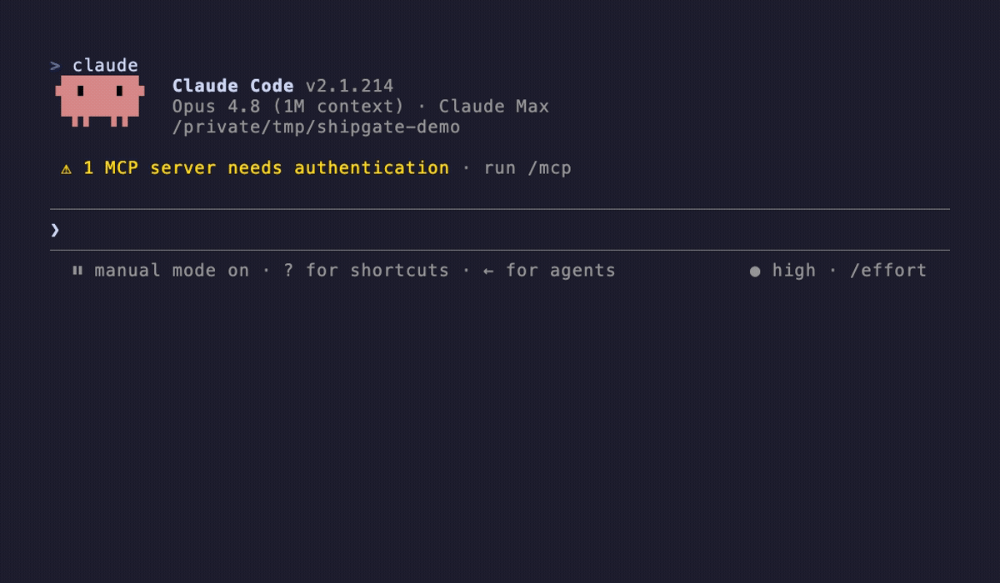

<div align="center">

# 🚦 Ship Gate: a pre-push quality gate for Claude Code that an agent can't skip with a flag

### I kept skipping my own checks at 1am. This one doesn't let me.

     

</div>

---

Claude Code is Anthropic's AI coding assistant: it runs in your terminal, reads your project's files, and can change them for you. Ship Gate is a plugin for it, a bundle you install and switch on in one go. Before Claude can push to your main branch, it has to get past whichever of the eight checks apply to what you changed, from tests and type checks through to a secret scan and a code review. Fail one and the push doesn't happen.

![Where the gate sits, as a two-row comparison. The usual setup: Claude runs git push with the --no-verify flag, git checks its own hook but the flag switched it off, and the code lands on main with nothing run, because the check lives inside git. Ship Gate: Claude pushes with or without the flag; Ship Gate answers first, before the push command runs, so git is never reached; the push is denied without a fresh pass for that commit, and goes through when every gate is green. It stands outside git, so the flag has nothing left to switch off. The gates are tests, lint, typecheck, build, secret scan, code review, security and UAT sign-off. It covers Claude's pushes to your protected branch, a push hidden in bash -c is not chased, and the gates are switchable per project.](docs/where-the-gate-sits.svg)

## What problem does this solve?

Every quality check I had ran on my own memory. The standard fix is a git **pre-push hook**, a script git runs for you just before a push, and it takes exactly one flag to switch off: `git push --no-verify`. Anything that badly wants the push to succeed, me at 1am or an agent moving fast on my behalf, will reach for that flag.

Ship Gate moves the check out of git. It's a Claude Code **`PreToolUse` hook**: a small script that Claude Code itself runs before carrying out any command, so the assistant never gets to decide whether it runs. By the time git would consult its own hooks, the push has already been allowed or denied. There's no flag to pass, because git is never reached.

What lets a push through is a **pass marker**. When every gate that applies has passed, `/ship` writes a short-lived marker naming that exact commit, and the hook allows the push only while that marker exists and still matches. Change one line afterwards and it stops matching, so you gate again. Which gates apply depends on what you touched: a docs-only change skips the judgment gates entirely.



*Asked to "just push to main and skip the gates," Claude runs `/ship` instead. The gates pass (a docs-only change here, so the heavy ones auto-skip), and it pushes. Every frame is a real run.*

## Why I built this

I run the same ritual before every push to main: tests, a review pass, a security glance, a secret scan. For the longest time the only thing enforcing that ritual was *me* remembering to do it, and discipline is exactly what evaporates at 1am.

My first version was dumb in an instructive way. I turned it on for every repo on my machine at once, and it immediately blocked a push in a hackathon repo that had never asked for it. Fair. So enforcement went strictly opt-in.

Then, hardening the part that decides *"is this command actually a `git push`?"*, my own [deep-review](https://github.com/aksheyw/claude-code-deep-review) methodology plus three red-team passes found seven different ways a shaped command slipped a real push past the detector: `FOO=bar git push`, a commit message containing the words "git push", a 100k-character command that times the hook out, `$'...'` quoting that desyncs the parser, and more. Reimplementing bash's parser inside a hook is a leaky abstraction, because only bash truly parses bash.

Then I walked back the opt-in decision, but only partly. The footgun was never that gating was on by default; it was that there was no easy way out, and the detector cried wolf on a commit message that happened to contain the words "git push". So default-on came back, but as a switch *I* turn on with the installer: four ways to step out, and a detector that no longer trips over its own shadow. On for everything, trivial to turn off for anything. That's the version I actually wanted.

The full story of how this was designed and hardened is the [product case study](CASE-STUDY.md).

## What it won't do

Ship Gate stops the accidental push and the fast-moving agent. It's **not a sandbox**, and it doesn't try to be. You can always hide a push inside `bash -c` or a `$(...)`, and chasing every wrapper like that means rebuilding bash inside a hook, which just opens new holes. So I fixed those seven, then stopped on purpose and wrote the boundary down instead of glossing over it. The marker and the `/ship` workflow do the real work; the hook just takes the one-keystroke escape off the table.

**And it only sees what Claude Code does.** A push from your own terminal, or a merge button on GitHub, never reaches it, so this is a pre-flight check and not a replacement for branch protection. One more seam worth saying out loud: Claude Code treats a hook that fails to *execute* as non-blocking, so "always runs, answers fast" had to be engineered into the hook rather than assumed from the runtime.

**It's also meant to be easy to get out of**, because a gate you can't escape is a gate you'll rip out. One session: `export SHIPGATE_DISABLE=1`. One repo: `/ship off`. The whole machine: `enabled:false` in `~/.shipgate.json`. Or back to opt-in everywhere: `--no-default-on` at install time, or `defaultEnabled:false` afterwards.

<details>
<summary>🔍 <b>The exact boundary, the two edges left open, and why I trust the rest</b></summary>

<br>

**Scope boundary (deliberate):** the gate matches `git push` as a *simple command*, honoring env-assignment prefixes, git global options, and bash quoting/escaping. It does **not** chase a push hidden inside a wrapper (`bash -c`, `eval`, `$(...)`, `sudo`, `xargs`, …) or obscured by I/O redirection, because closing those is unbounded shell-reimplementation that tends to introduce *new* holes. One seam remains different in kind (a bounded fix, tracked for a hardening release): the hook judges a push against the repo the session is standing in (a push aimed at a different repo via `git -C` is evaluated by the current repo's gating, not the target's). Two narrow denial-of-service edges are documented rather than closed, because triggering them needs a hand-crafted multi-hundred-kilobyte push command, which, given the only party who can feed this hook a command is you or your agent pushing your own code, is not a realistic threat: a push carrying a quoted or backslash-hidden refspec (`"feature:main"`, `feature:ma\in`) is not matched, and a command padded with hundreds of thousands of backslash-newline line-continuations can make the gate slow enough to time out. Ship Gate is a guardrail for the normal and the accidental, backed by the marker workflow, not a sandbox against a determined adversary. (The `src:dst` refspec-source hole that shipped in 0.5.0 **is** closed in 0.5.1: a legitimate `feature:main` inside a valid pass window no longer certifies.)

**And why I trust the rest of it:**

- **Fail-closed.** The hook is self-contained (no sourced libraries) and routes every failure mode it can evaluate (missing/expired/mismatched marker, unparseable config, even a missing `awk`) to **deny**. The honest caveat: a hook that fails to *execute* is non-blocking in Claude Code, so "always executes, never times out" is itself an engineered property here: dependency-free with quoted paths, O(n) parsing, both locked by regression tests that reproduce the historical fail-open bugs. That is a design goal rather than a guarantee, and the padded-command edge in the scope boundary above is the one case where a deliberately crafted input can still defeat it.
- **On by default, with four ways out.** A personal install gates every repo; a marketplace install gates only repos with a `.shipgate.json`. Whichever you use, you can step out at four levels: a session bypass (`SHIPGATE_DISABLE=1`), a machine-wide off switch (`enabled:false` in `~/.shipgate.json`), a per-repo pause (`/ship off`), or `--no-default-on` at install time. A repo you've stepped out of is never gated, and in opt-in mode a repo that never adds `.shipgate.json` is never touched, so an install can't hijack a project you decided not to cover.
- **Marker-bound.** A push is allowed only when `.git/shipgate/last-pass.json` records the **exact commit** about to be pushed, on the right branch, within a configurable TTL (default 900s). Pass the gates via `/ship` and the marker is written for you; otherwise it isn't there.

</details>

## Eight pieces, and the one that does the blocking

A **skill** is a markdown file of instructions Claude loads when a matching task comes up. An **agent** is a separate assistant with one job. A **rule** is a standing instruction loaded into every session. A **hook** is a script Claude Code runs automatically at a fixed moment, so it can block an action rather than politely ask.

| Component | Kind | What it does |
|---|---|---|
| `ship` | Skill | **The orchestrator.** Runs every gate, prints a summary, then writes the pass marker and pushes once everything required is green. A command ("ship it", `/ship`) authorizes the push; a question ("is this ready?") or `--dry-run` reports without pushing. It pauses when something needs you: a UAT call, a deploy target it spotted, or the **merge guard** when you're on a feature branch carrying commits that haven't cleared the gates. |
| `ship-init` | Skill | **Setup.** Detects your test, lint, typecheck and build commands and scaffolds `.shipgate.json`. |
| `ship-review` | Skill | **The code-review gate.** Runs `/code-review` plus a distilled checklist; returns Approve, Warning or Block. |
| `ship-security` | Skill | **The security gate.** Applies a security checklist to the diff. |
| `ship-reviewer` | Agent | The fallback reviewer when `/code-review` isn't installed; embeds all the review dimensions inline. |
| Push-block hook | `PreToolUse` hook | `plugins/ship-gate/hooks/hooks.json` plus `scripts/check-push.sh`. Denies a push to the protected branch without a valid marker. **This is the piece that takes the one-keystroke skip off the table.** |
| Trigger rule | Rule | Routes plain-language ship intent ("ship it") to `/ship`. |
| `ship-gate.sh` | Script | The deterministic runner: runs the gates, emits the file list a review has to cover, and `doctor` audits an existing config and proposes the fix. Reusable in CI, the automated checks that run on every push. |
| `shipgate.schema.json` | Config | A JSON Schema (Draft-07) so your editor autocompletes `.shipgate.json`. |

Everything deterministic is dependency-free **bash, jq and awk**; the skills hold prompt logic only. The test suite is **447 assertions** across `plugins/ship-gate/scripts/test/*_test.sh`, with no framework required.

## The two failures I care most about catching

Both are cases where a check reports success without having done anything.

**A gate that's on but has no command** becomes a visible `[WARN]` you have to acknowledge, never a silent green tick.

**A gate switched off long ago that the repo has since outgrown** is the mirror image. A `.shipgate.json` that once said "docs-only repo, tests off" keeps reporting a clean `[SKIP]` after the repo grows a real test suite. So when one of the four command gates (tests, lint, typecheck, build) is disabled, the runner does a cheap filename scan to see whether that capability now exists:

```
[DRIFT] tests: disabled in config, but 12 test file(s) detected (e.g. tests/test_api.py): run '/ship doctor' to review, or set gates.tests.reason if this is intentional
```

That pauses the ship until you acknowledge it. Record *why* the gate is off and it becomes `[DRIFT-ACK]`: still printed on every ship, so the reason is never buried in a commit message, but no longer a pause, because a dated and conscious decision doesn't need re-litigating every time.

**And a review has to cover every file.** Code review is a judgment gate, so on a large change a model can review a subset and still report a pass. `ship-gate.sh changed-files` emits the authoritative file list computed from git rather than from the model's reading of the diff, and every path must be reviewed or explicitly excused. Coverage reports as `N/M files`, and an unaccounted path makes the gate incomplete rather than passed.

<details>
<summary>📄 <b>What a run actually prints</b></summary>

<br>

`/ship --dry-run` on a TypeScript project. The shape is what the orchestrator emits; the values are made up:

```
## Ship Gate Summary
[PASS] tests: 248 passed (npx vitest run)
[PASS] lint / typecheck: clean / clean
[SKIP] build: skipped (disabled)
[PASS] secretScan: clean
[PASS] codeReview: Warning carried forward (resolved via: ship-review → /code-review)
[PASS] security: Approve (resolved via: ship-security)
[USER] uat: 80% UI impact (user decision: required)
[SKIP] regression: skipped (not test-affecting)
[SKIP] audit / deep: not requested
Branch: feature/checkout-v2   Target: origin/main
```

`--dry-run` stops at the summary, writes no marker and pushes nothing. Without it, an imperative `/ship` pushes on its own once every required gate is green. Not in this example, though: UAT is `[USER]`-required and unsatisfied, so it pauses for your call first.

And the deterministic runner, here in this very repo, which has no test command configured:

```
$ bash plugins/ship-gate/scripts/ship-gate.sh run
[WARN] tests: no command detected
[WARN] lint: no command detected
[WARN] typecheck: no command detected
[SKIP] build (disabled)
[RUN]  secretScan
[PASS] secretScan
```

</details>

## Install

**You need [Claude Code](https://claude.com/claude-code) itself first**, since this is a plugin for it, plus `git`, `bash`, `jq` and `awk`. On Windows, use WSL or git-bash. **Pick one mode**, because running both installs duplicate commands.

**Marketplace** guards only repos that contain a `.shipgate.json` config file, so it's opt-in per project:

```
/plugin marketplace add aksheyw/claude-code-ship-gate
/plugin install ship-gate@ship-gate
```

**Personal** guards every repo on your machine. Add `--no-default-on` to keep it opt-in instead:

```sh
git clone https://github.com/aksheyw/claude-code-ship-gate.git
cd claude-code-ship-gate
bash install-local.sh                        # or: bash install-local.sh --yes --no-default-on
```

**Then restart Claude**, because hooks only load when a session starts.

Now open the project you actually want to gate, and scaffold a config for it. `/ship-init` is typed inside Claude, not in a shell. It reads your `package.json`, `go.mod`, `Cargo.toml` or `pyproject.toml` and fills in the commands it finds:

```
/ship-init
```

After a **marketplace** install every command is namespaced, so that one is `/ship-gate:ship-init` and `/ship` is `/ship-gate:ship`. A marketplace install also can't add the "ship it" trigger, because a plugin may not write to `~/.claude/rules`; the fold below has the one line to add yourself.

<details>
<summary>📦 <b>Install detail: what each mode writes, namespaced commands, and going back to opt-in</b></summary>

<br>

**Mode A, personal.** Installs bare-named personal skills (`/ship`, `/ship-init`, `/ship-review`, `/ship-security`), copies the `ship-reviewer` agent, and merges the push-block hook into `~/.claude/settings.json`. Any existing `~/.claude/skills/ship.md` is backed up to `ship.md.bak` first. It also installs the trigger rule to `~/.claude/rules/shipgate-trigger.md` (so "ship it" routes to the gate) and turns on default-on by adding `defaultEnabled:true` to `~/.shipgate.json`, merged without touching any other keys there.

```sh
bash install-local.sh                        # interactive; turns on default-on
bash install-local.sh --yes                  # non-interactive
bash install-local.sh --yes --no-default-on  # install, but keep Ship Gate opt-in per repo
```

> After a personal install, the hook gates **every** repo Claude pushes a protected branch on, not only ones with a `.shipgate.json`. That's the point of default-on, but it's a real behavior change. To go back to opt-in, set `defaultEnabled:false` in `~/.shipgate.json` (or remove the file); to pause one repo, run `/ship off`; for a single session, `export SHIPGATE_DISABLE=1` before launching Claude.

> Installed skills reference this repo's scripts by absolute path. If you **move** this repo, re-run `install-local.sh`. If a ship-gate hook with an old path is already present in `settings.json`, remove that entry before re-running so the new path takes effect.

**Mode B, marketplace.** Commands are namespaced: `/ship-gate:ship`, `/ship-gate:ship-init`, `/ship-gate:ship-review`, `/ship-gate:ship-security`. Hooks activate automatically on install. To test locally from a clone, use `/plugin marketplace add .` instead. A marketplace install does not include the natural-language trigger, because a plugin can't write to `~/.claude/rules`. Two optional add-ons:

- **Want "ship it" to trigger the gate?** Add one line to your own rules (e.g. `~/.claude/CLAUDE.md`): *"When I tell you to ship/release/push to main, run `/ship-gate:ship`, which runs the gates and pushes on green. When I ask whether to ship, run `/ship-gate:ship --dry-run` and never push."*
- **Want default-on everywhere?** Create `~/.shipgate.json` containing `{ "defaultEnabled": true }`. Revert by setting it `false` or removing the file.

**Just the review checklists, no gate.** `ship-review` and `ship-security` carry self-contained checklists and work as standalone skills:

```sh
npx skills add aksheyw/claude-code-ship-gate --skill ship-review --skill ship-security
```

Plainly: `/ship` and `/ship-init` need the full plugin runtime. The push-block hook and the deterministic scripts don't ship through a bare skills install, so a skills-only install gives you the two review checklists, not the gate. One more caveat: `ship-review` prefers a `/code-review` skill and falls back to the bundled `ship-reviewer` agent, which also only ships with the full plugin; without either, its distilled checklist still runs on its own.

</details>

## Configuring it

Ship Gate reads a `.shipgate.json` at your project root. `/ship-init` writes one for you, and anything you leave out falls back to a sensible default. Here are all eight gates. Every command ships as `null`, which means auto-detect; `/ship-init` fills in whatever it actually finds in your project, like the `npx vitest run` below:

```json
{
  "mainBranch": "main",
  "gates": {
    "tests":      { "enabled": true,  "command": "npx vitest run" },
    "lint":       { "enabled": true,  "command": null },
    "typecheck":  { "enabled": true,  "command": null },
    "build":      { "enabled": false, "command": null },
    "secretScan": { "enabled": true },
    "codeReview": { "enabled": true, "skill": "ship-review" },
    "security":   { "enabled": true, "skill": "ship-security" },
    "uat":        { "enabled": true, "skill": "verify", "mode": "confidence" }
  },
  "markerTtlSeconds": 900
}
```

`uat` is user acceptance testing: your own sign-off that the change actually works. It's the one gate that asks a human rather than running a command, and `"skill": "verify"` names an optional external skill it will use if you have one installed, falling back to a plain confirmation prompt if you don't.

**[Full configuration reference →](docs/CONFIGURATION.md)** covers every key, multi-suite test gates for monorepos, which gates run on which kinds of change, how to swap in an external reviewer, **how to turn the gate off at any of four levels**, how to verify it's really working, and troubleshooting.

## Companion repos

Part of a small family of opinionated Claude Code tools:
[**claude-code-deep-review**](https://github.com/aksheyw/claude-code-deep-review) ·
[**claude-code-rules**](https://github.com/aksheyw/claude-code-rules) ·
[**context-bridge**](https://github.com/aksheyw/context-bridge) ·
[**claude-code-pm-agents**](https://github.com/aksheyw/claude-code-pm-agents) ·
[**claude-code-learned-skills**](https://github.com/aksheyw/claude-code-learned-skills)

<details>
<summary>🌉 <b>What each one is for</b></summary>

<br>

- [**claude-code-deep-review**](https://github.com/aksheyw/claude-code-deep-review): the 14-lens review methodology this plugin's `--deep` gate distills from. Found 14 production bugs (2 ship-stoppers) on its first use, and the seven fail-opens above in *this* very plugin.
- [**claude-code-rules**](https://github.com/aksheyw/claude-code-rules): opinionated global rules (honesty and earned-confidence, TDD, immutability, branch strategy) that shaped how these gates are wired.
- [**context-bridge**](https://github.com/aksheyw/context-bridge): resume Claude Code sessions warm, with a per-project wiki and a generated handoff prompt.
- [**claude-code-pm-agents**](https://github.com/aksheyw/claude-code-pm-agents): seven subagents covering the product-builder lifecycle: PRDs, growth, brand, app-store optimisation (ASO), search optimisation (SEO), YouTube and comms.
- [**claude-code-learned-skills**](https://github.com/aksheyw/claude-code-learned-skills): 12 skills captured from real debugging and research sessions, covering Docker/SSH/VPS, ML pipelines, prompting guides, quality tooling and a project wiki.

</details>

## Credits

Ship Gate's four bundled reference files **distill** best practices from [**gitleaks**](https://github.com/gitleaks/gitleaks), [**OWASP**](https://owasp.org), **vibe-security**, **audit** and the **code-reviewer** agent, plus my own [**deep-review**](https://github.com/aksheyw/claude-code-deep-review), which is where the 14 lenses come from. You don't need any of them installed.

> Ship Gate distills inputs from and orchestrates these projects but does not speak for their guarantees or support.

<details>
<summary>📋 <b>Which file distills what, and every optional upgrade it can use</b></summary>

<br>

The four bundled reference files are `code-review-checklist.md`, `security-checklist.md`, `audit-checklist.md` and `deep-review-lenses.md`. They ship inside the plugin, so none of the projects they distill from needs to be installed for the gates to work.

Ship Gate can *optionally* use `vibe-security`, `code-reviewer`, `coderabbit`, `ai-regression-testing`, `audit` and `/deep-review` when you configure them and they're installed. An installed external simply upgrades the bundled default; a missing one never hard-blocks, it warns once and falls back.

Separate **companion plugins** that run on their own, and which Ship Gate does not call: `security-guidance` (Anthropic edit, commit and push reminder hooks), `aikido` (static analysis, known as SAST, plus secret scanning), `42crunch` (OpenAPI scanning), `sensitive-canary` (secret-scan hooks). All unversioned; see upstream.

</details>

## License

MIT. See [LICENSE](LICENSE). Contributions welcome, see [CONTRIBUTING.md](CONTRIBUTING.md), and the release history is in [CHANGELOG.md](CHANGELOG.md).

Built by [Akshey Walia](https://github.com/aksheyw).
